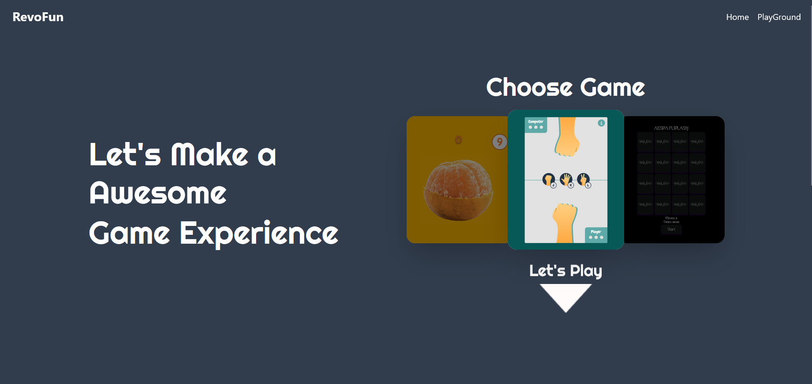

# RevoFun - Interactive Website Games

### Project Milestone 2 - Interactive Website Games
### By Enrico Zada (Team 2)

## Overview
RevoFun is an interactive web-based game collection platform that offers multiple mini-games in a single, user-friendly interface. The project focuses on delivering a fun gaming experience.

## Table of Contents
- [Features](#features)
- [Technologies Used](#technologies-used)
- [How To Use](#how-to-use)
- [Screenshots](#screenshots)
- [Live Demo](#live-demo)

## Features
**Dynamic Game Selection**: Interactive carousel-style game selector
**Multiple Games**: RevoFun offers a variety of mini-games, including:
- Orange Clicker: A clicking-based game
- Rock Paper Scissors: Classic hand game
- AE Flip Card: Memory matching game

## Technologies Used
- HTML
- Tailwind CSS
- JavaScript

## How To Use
1. Clone this repository:
   ```bash
   git clone https://github.com/revou-fsse-feb25/milestone-2-enrico-zd.git
   ```

2. Navigate to the project directory:
   ```bash
   cd milestone-2-enrico-zd
   ```

3. Install Tailwind:
   ```bash
   npm install tailwindcss @tailwindcss/cli
   ```
4. Run Tailwind:
   ```bash
   npm run build
   ```

3. Open the `index.html` file located in the project directory using [Live Server](https://marketplace.visualstudio.com/items?itemName=ritwickdey.LiveServer) or the [Live Preview](https://marketplace.visualstudio.com/items?itemName=ms-vscode.live-server) extension to view the webpage locally.

## Screenshots


## Live Demo
[View Website](https://revofun-ez.netlify.app/)